> 去吧！皮卡丘！
> 小时候拥有一台任天堂是多少熊孩子的梦想，每个夜晚被窝里透出的微弱光线，把小小的童年带入另一个世界，家门口的鸟和狗，森林里的虫和瀑布，山洞里的超音蝠，第一次钓鱼，第一次骑自行车，踩过一片片草地，走过一个个城市，一路冒险，飞天潜水，攀瀑碎岩，所向披靡。
> 每天早上醒来，都恍如出门冒险的那天清晨~ 那是属于80后最珍贵的记忆~
> <div style="text-align: right;"> - 前言</div>

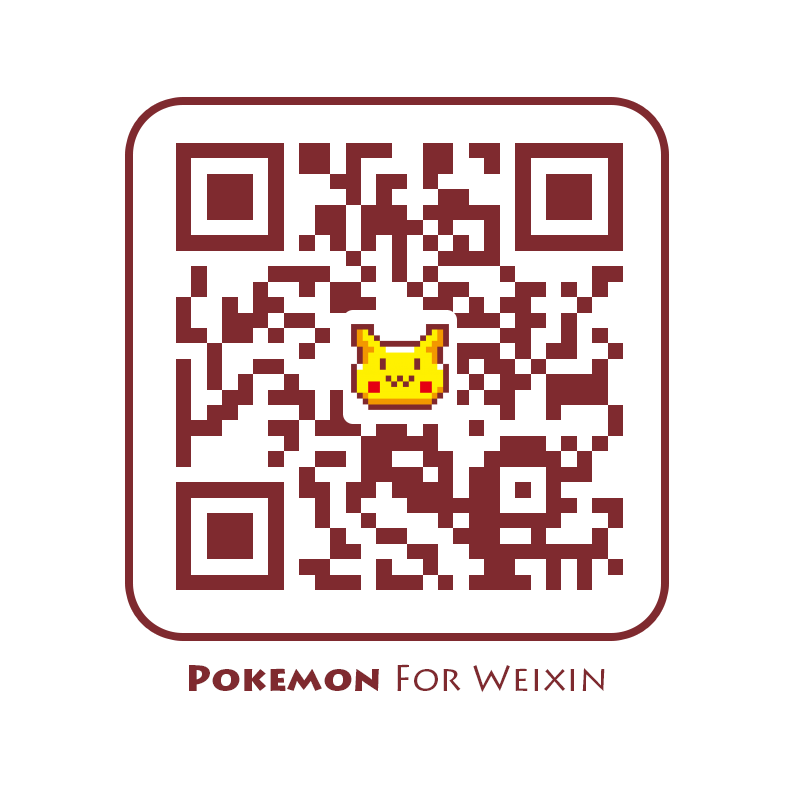
## 准备工作

### 一、确定功能需求
#### 第一阶段
1、用户体系
2、背包
3、图鉴
4、人物定位
5、精灵分布
6、精灵捕捉
7、排行榜
8、移动随机事件
9、新手引导

#### 第二阶段
1、地图增加道馆挑战
2、日常任务系统

#### 第三阶段
1、精灵交易
2、玩家对战
3、AR捕捉场景


### 二、开放地图选择
| 功能 / 厂商  | 百度地图 | 腾讯地图 | 高德地图
| --------   | -----   | ----     | -----
| 自定义皮肤   |  支持   |   不支持    | 支持
| 实时定位     |  不支持   |   支持   |  支持
| 开发文档     |   差    |  一般  |  友好

对比三个地图厂商，我们选择高德地图进行二次开发

###  三、申请高德地图SDK

登录http://lbs.amap.com/
控制台-应用管理-创建新应用-添加新KEY

### 四、接入微信授权

具体参考微信公众平台开发者文档
https://mp.weixin.qq.com/wiki?t=resource/res_main&id=mp1421140842

### 五、服务端接口

我们需要一些接口来保存用户数据，所以需要找一个服务端的同学配合完成几个简单的接口
1、api/login 判断登录状态，获取用户基本信息
2、api/getGlassPokemon 获取草地精灵
3、api/getMyPokemon 获取背包精灵
4、api/catchPokemon 捕捉精灵
5、api/getRank 获取排行榜信息


### 六、素材准备
1、简单设计一下主界面UI，确定每个功能布局，和地图的配色方案

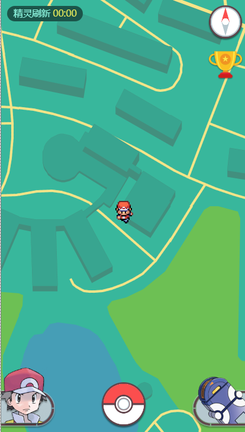

2、准备150只精灵的素材图片（大小各一套）


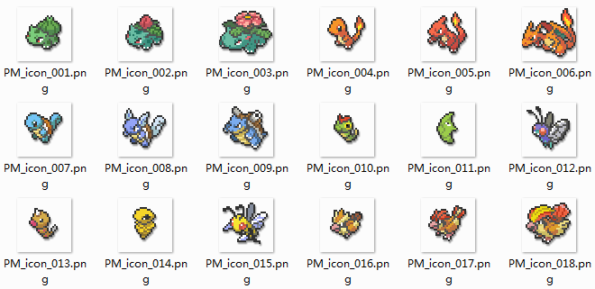


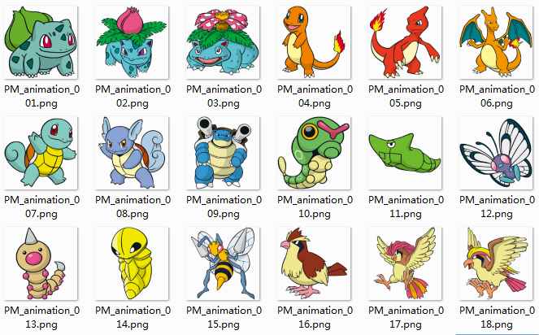


## 现在开始 ##

### 一、接入高德地图

在`<head></head>`中引入高德地图js-sdk

```
<head>
    <script src="http://webapi.amap.com/maps?v=1.3&key=464e2c3addc64c5894994afe0bbdca21">
</head>
```
> key的值为高德地图开发者中心创建应用后获得的key

在html中创建地图容器

```
<div id="gomap"></div>
```
在js中初始化地图

```
var gomap;
gomap = new AMap.Map('gomap', {
    zoomEnable : false,              //不允许缩放
    zoom:18,                         //默认缩放等级18
    center: [118.18088, 24.4896],    //初始定位坐标
});
```
至此地图已经接入完成 [查看DEMO][1]

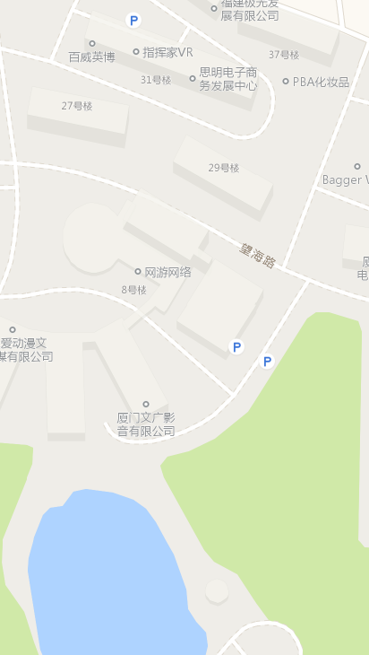


### 二、地图美化

默认的地图样式不能满足我们的需求，高德地图提供了地图皮肤编辑器：[高德地图皮肤编辑器][2]


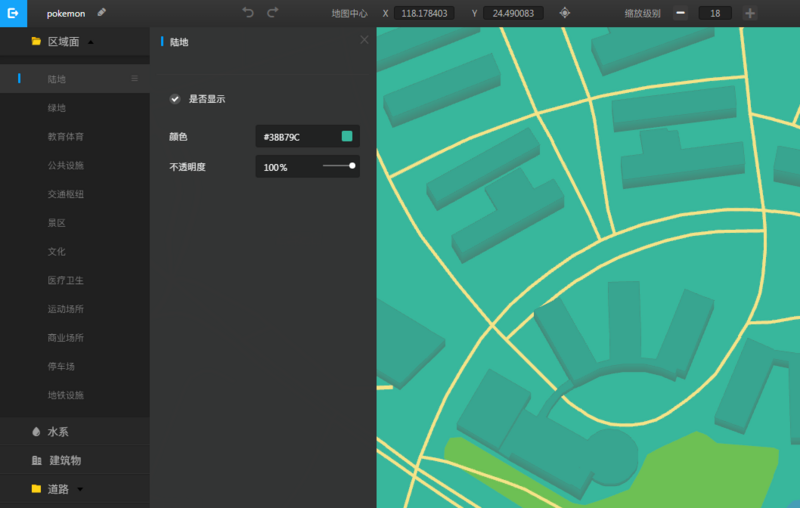


在编辑器中修改道路，陆地，建筑，水域等颜色，同时在配置中修改每种标志物显示情况，简化地图。
编辑完成后点击发布，获得地图样式ID：e6fa21422698f8a28585158d9d075f1d
在地图初始化中引入地图样式即可

```
var gomap;
gomap = new AMap.Map('gomap', {
    zoomEnable : false,
    zoom:18,
    center: [118.18088, 24.4896],
    mapStyle : 'amap://styles/e6fa21422698f8a28585158d9d075f1d'
});
```


[查看DEMO][3]


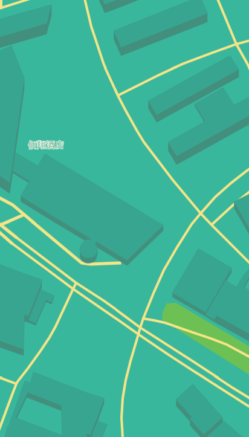


这样看起来就有点游戏的样子了

### 三、地图定位

我们需要把地图和主角定位在当前位置，并且在移动时实时更新定位，这就需要借助AMap的geolocation插件

```
gomap.plugin('AMap.Geolocation',function(){
    var geo = new AMap.Geolocation({
        showButton: false,
        showCircle: false,
        showMarker : true,               //显示定位图标
        markerOptions : {
            content : '<div class="Symbol hero"></div>', //设置marker自定义节点内容
        }
    });
    gomap.addControl(geo);
    geo.watchPosition();        //实时获取定位
    AMap.event.addListener(geolocation, 'complete', onComplete);//返回定位成功信息
    AMap.event.addListener(geolocation, 'error', onError);      //返回定位出错信息
})
```

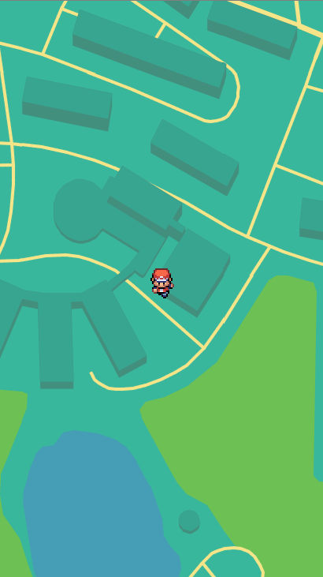


小智一个人站在地图上有点孤单，我们给他加一个光环放大的效果，看起来像是在发出检测信号：

    .Symbol.hero:after{
        -webkit-animation:heroWave 2s ease infinite;
        background:rgba(255,255,181,0.1);
        content:'';
        width:100px;
        height:100px;
        display:block;
        position:absolute;
        left:-30px;
        top:-30px;
        border-radius:100%;
        box-shadow:0 0 0 1px rgba(255,255,181,0.7);
        opacity:0.7;
    }
    @-webkit-keyframes heroWave{
        0%{ -webkit-transform:scale(0.2);opacity:0}
        50%{ opacity:1}
        100%{ -webkit-transform:scale(1);opacity:0}
    }

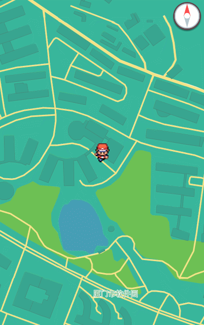

[查看DEMO][5]

### 四、罗盘

有了定位，我们还需要知道自己移动的方向，方便接近目标，所以我们在界面右上角放置了一个虚拟罗盘

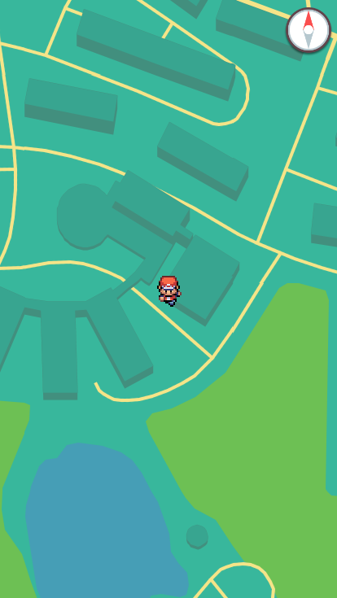

通过监听HTML5的deviceorientation获取指南针角度信息，改变罗盘旋转方向：

```
if (window.DeviceOrientationEvent) {
    window.addEventListener("deviceorientation", function(event){
        var dir =  event.webkitCompassHeading;
        $("#J_pin").css("-webkit-transform",'rotate('+ (360-dir) +'deg)');
    }, false);
}
```
[查看DEMO][6] (罗盘只在移动端生效，扫码查看)


### 五、精灵数据

由于精灵的编号，属性，星级等数据是固定的，我们需要在前端创建一个保存精灵图鉴数据的JSON文件，以减少服务端返回数据的复杂度，只需通过编号，在图鉴中索引对应精灵的相关数据

```
var Pokedex = [
    {
        'number':'001',
        'name' :'妙蛙种子',
        'name_jp' : 'フシギダネ',
        'name_en' : 'Bulbasaur',
        'properties' : ['草','毒'],
        'star' : 4,
    },
    {
        'number':'002',
        'name' :'妙蛙草',
        'name_jp' : 'フシギソウ',
        'name_en' : 'Ivysaur',
        'properties' : ['草','毒'],
        'star' : 4,
    },
    ...
];
//精灵属性颜色配置
var Pokedexcolor = {
    '草' : '#1ba50e,#2ec920',
    '冰' : '#13c6db,#57e9ff',
    '超能力' :'#dd045b,#f7478d',
    '虫' : '#889610,#b5b214',
    '地面' : '#af8a19,#d8b343',
    '电' : '#b28200,#ffd621',
    '毒' : '#752464,#9e448c',
    '飞行' : '#4381ff,#72aefc',
    '钢' : '#6d6d8a,#aaaabb',
    '格斗' : '#902918,#bb5544',
    '火' : '#c72500,#f05526',
    '龙' : '#2b1aa6,#7766ee',
    '水' : '#2b1aa6,#3088e1',
    '岩石' : '#907d2f,#a89755',
    '一般' : '#969685,#bbbbaa',
    '幽灵' : '#3d3d7c,#5f52a7',
    '妖精' : '#3d3d7c,#5f52a7',
}
```

> 编号001精灵对应的小图地址为`'images/pokemon/001.png'`，大图地址为`'images/pokemon_big/001.png'`

### 六、在地图上添加精灵

主角有了，但是地图空空如也，现在我们需要在主角周围生成一些随机的精灵，通过调用getGlassPokemon接口，传递当前位置坐标，服务端在坐标半径1公里内生成一定个数的精灵，前端通过返回的坐标和精灵编号将对应精灵添加到地图上。

> 由于后续接口需要验证微信授权信息，为了便于DEMO查看请先访问一次模拟登陆接口：[http://www.guowc.cc/api/sysUser/login?openid=o3aw6v1QLA6R7B0w6vPBfL9Ti8Mw][7]


`getGlassPokemon`接口返回数据格式：

```
data : {
    {
        id : 231,     //精灵唯一标识，用于捕捉成功后从数据库中精准删除地图对应精灵
        number: "77",          //精灵编号，用于图鉴中获取更多精灵信息
        lng : 118.094561807441    //精灵经度
        lat : 24.4805797983452    //精灵纬度
    },
    ...
}
```

首先在前面的geolocation插件中调用`getCurrentPosition()`方法，获取一次初始定位坐标，
将坐标传给`getPokemons`接口拉取草地精灵数据

```
var self = this
gomap.plugin('AMap.Geolocation',function(){
    var geo = new AMap.Geolocation({
        ...
    });
    ...
    //首次定位
    geo.getCurrentPosition(function( status, result ){
        heroPoint.lng = result.position.lng;
        heroPoint.lat = result.position.lat;
        self.getPokemon(heroPoint)
    });
})
```

请求接口数据：

```
getPokemon : function(point) {
    var self = this
    Method.fetch(Api.getGlassPokemons,{ lng:point.lng,lat:point.lat },function(data){
        var res = data.data;
        for(var i = 0; i < res.length; i++){
            self.addPokemon(res[i]);
        }
    });
},
```

> Method.fetch为封装的ajax方法，只贴出关键流程代码，具体详见DEMO

获取到数据后，循环调用addPokemon方法，将精灵添加到地图上：

```
addPokemon : function(data) {
    var pid = Method.getPid(data.number); //获取精灵编号（格式化'12'=>'012'）
    var marker =  new AMap.Marker({
        map: Common.gomap,
		position: [data.position_x, data.position_y],
        icon: new AMap.Icon({
            size: new AMap.Size(40, 40),
            imageSize : new AMap.Size(40, 40),
            image: "images/pokemon/PM_icon_"+ pid +".png",
        }),
    });
},
```
[查看DEMO][8]

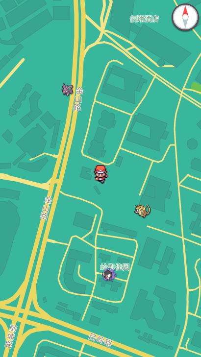

现在我们就能在地图上看到精灵了～

### 七、获取背包精灵
这一步我们先把已捕捉到的精灵列表保存起来，以便后续使用：

```
getMyPokemons : function(){
    Method.fetch(API.getMyPokemons,{},function(data){
        for(var i = 0 ;i < data.data.length; i++){
            State.bag.push(Method.getPid(data.data[i].number));   //将已获得精灵编号保存在全局State.bag数组中
        }
    });
}
```

### 八、精灵收集
#### 操作优化
精灵收集是整个游戏的核心功能，原版pokemonGo精灵捕捉过程为AR实景捕捉形式，我们把精灵的捕捉形式简化了，保留街机时代的像素风格。最早在实现这个功能时，采用的策略是当玩家坐标与地图精灵小于一定距离时，自动进入精灵捕捉场景，这种方式存在几个问题：
1. 用户位置发生变化时，需要不断计算用户坐标与地图上所有精灵的距离，计算量较大
2. 可能存在同时与两个精灵距离符合捕捉条件，而一次只能捕捉一只精灵
3. 用户如果不移动，基本很难捕捉到精灵

优化后将捕捉规则修改为：直接点击地图精灵即可捕捉，半径500米外提示用户需走进范围才能捕捉。优化后的方案降低了捕捉门槛，也鼓励用户走动去发现和捕捉更多精灵。

#### 数据传递
上一步的addPokemon方法中，我们已经向地图中添加了精灵点标记（marker），但此时地图上的精灵唯一区分只是图片不同而已，我们还需为每个marker绑定对应的精灵信息，并为每个marker绑定点击事件，下面完善一下addPokemon方法：
```
addPokemon : function(data) {
    var self = this;
    var nid = parseInt(data.number);
    var pid = Method.getPid(data.number); //获取精灵编号（格式化'12'=>'012'）;
    var id = data.id;
    var marker =  new AMap.Marker({
        map: Common.gomap,
		position: [data.position_x, data.position_y],
        icon: new AMap.Icon({
            size: new AMap.Size(40, 40),
            imageSize : new AMap.Size(40, 40),
            image: "images/pokemon/PM_icon_"+ pid +".png",
        }),
        extData : {
            nid : nid,
            id  : id,
        }
    });
    marker.on('click',function(e){
        self.clickPokemon(e)
    })
},
```

由于地图上显示精灵图标过小，无法展示更多信息，所以我们在点击精灵后，没有直接进入战斗，先弹出对应精灵的卡牌：

```
clickPokemon : function(e){
    var self = this;
    var data = e.target.getExtData();
    self.initPokecard(data.nid,e.target);
},
```


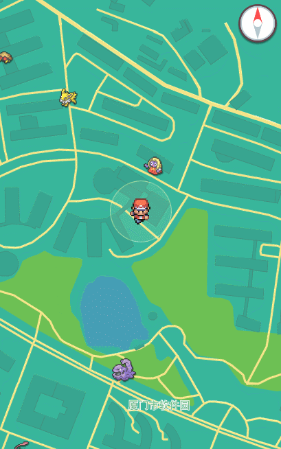


初始化卡牌弹窗：

```
<div class="Modal pokedex" id="js-modal-pokedex">
    <div class="card">
        <div class="namebox">
            <p class="name_cn"></p>
            <p class="name_jp"></p>
        </div>
        <div class="pokebox">
            
            <div class="Widget stars">
                <div class="star"></div>
            </div>
        </div>
        <div class="propbox">
            <div class="num"></div>
            <div class="prop"></div>
        </div>
        <p class="Widget timer tips"><b class="t">TIPS </b>捕捉半径<span class="t">500</span>米 当前距离<span class="t dist">0</span>米</p>
        <span id="js-btn-catch" class="catchbtn">捕捉</span>
    </div>
</div>
```

```
initPokecard : function(nid, target) {
    var $card = Element.$pokedex，
        $catch = Element.$catch;
    var data = Pokedex[nid - 1];   //从图鉴JSON中获取对应精灵详细图鉴数据
    var props = '', dist = 0;
    var imgUrl = 'images/pokemon_big/PM_animation_'+ data.number +'.png';

    //拼接属性节点
    for(var i = 0; i< data.properties.length; i++){
        var color = Pokedexcolor[data.properties[i]].split(',');
        props += '<div class="item" style="background:'+ color[1] +';border-color:'+ color[0] +'">'+ data.properties[i] +'</div>';
    }
    $card.find('.name_cn').text(data.name);  //精灵中文名
    $card.find('.name_jp').text(data.name_jp + data.name_en);  //精灵外文名
    $card.find('.star')[0].className = 'star star_' + data.star;   //精灵星级
    $card.find('.num').text('No.' + data.number);  //精灵编号
    $card.find('.prop').html(props);   //精灵属性
    //预加载精灵大图
    $card.find('.pokebox').removeClass('loaded');
    Method.loadImg(imgUrl, function() {
        $card.find('.pokeimg').attr('src',imgUrl);
        $card.find('.pokebox').addClass('loaded');
    });
    $card.addClass('show');
}
```
到这里就完成了精灵卡片的初始化（背包图鉴点击精灵小图共用这个弹窗），然而卡片只带有固定数据，需要跟单纯的图鉴查看器做区分，我们在卡片下方加上操作区，操作区有3种状态：精灵可捕捉，精灵已获得，精灵超出捕捉半径


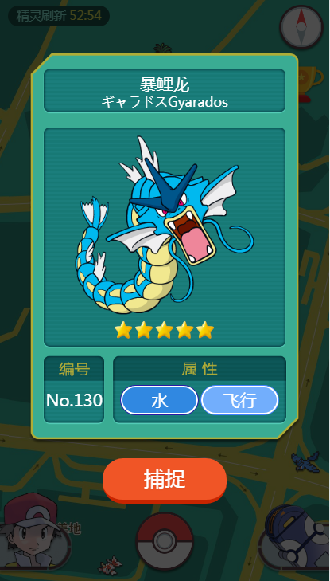
```
initPokecard : function(nid, target) {
    ...
    //判断点击精灵行为来自地图还是图鉴
    if(target) {
        var pa = target.getPosition(),
            pb = [State.heroPoint.lng,State.heroPoint.lat];
        var dist = parseInt(pa.distance(pb));  //计算主角与点击精灵距离

        $card.addClass('catch');
        $card.off().on('touchend',function(e){
            $(this).removeClass('show');
            e.preventDefault();
        })
        if( dist < 500 ) {
            $card.find('.tips').hide();
            if(State.bag.indexOf(data.number) != -1){
                $catch.removeClass().addClass('ownbtn').text('已获得');
            }else{
                $catch.removeClass().addClass('catchbtn').text('捕捉');
            }
        }else{
            $card.find('.dist').text(dist);
            $card.find('.tips').show();
            $catch.removeClass().addClass('overbtn').text('走近点啊亲');
        }
    }else{
        $card.removeClass('catch');
        $card.find('.tips').hide();
    }
}
```

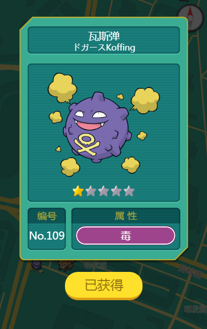

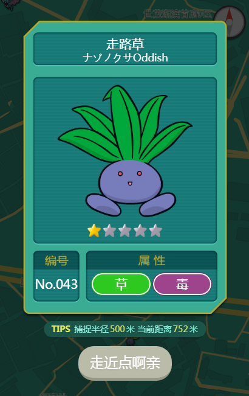

[查看DEMO][10]

### 九、精灵捕捉场景
首先为卡片下方的捕捉按钮绑定事件，将点击的精灵数据传递到meetPokemon方法中（初始化精灵捕捉场景方法）：

```
initPokecard : function(nid, target) {
    ...
    if(target) {
        var ext = target.getExtData()
        $catch.off();  //解除捕捉按钮绑定事件
        ...
        if( dist < 500 ){
            if(State.bag.indexOf('data.number) != -1){
                ...
            }else{
                $catch.on('touchend', self.meetPokemon(ext.nid,ext.id));
                target.setMap(null);  //开始捕捉后将地图上对应小精灵移除（捕捉成功or失败小精灵都会消失）
            }
        }
    }else{

    }
}
```
然后初始化捕捉场景：

```
meetPokemon : function(nid,id){
    Element.$modal.removeClass('show');
    Element.$body.addClass('State catching');  //进入捕捉场景需要控制界面多处UI，所以把状态class放到body上
    Element.$catchBox.find('.texture').attr('src','images/pokemon_big/PM_animation_' + Pokedex[nid].number + '.png');
    Element.$catchBox.find('.pname').text(Pokedex[nid].name);
    Element.$catchBox.find('.star')[0].className = 'star star_' + Pokedex[nid].star;
},
```
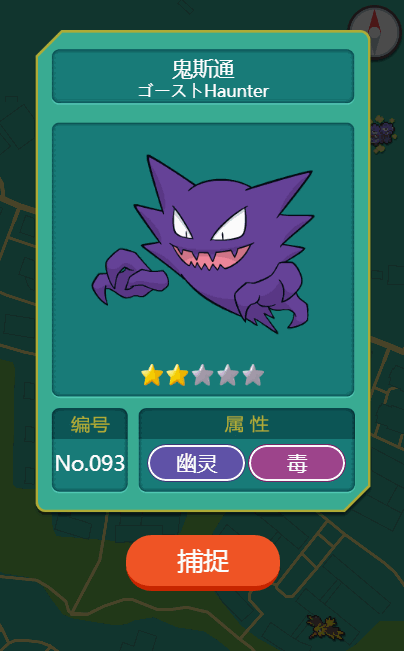

[查看DEMO][12]

### 十、去吧精灵球！
现在点击丢出精灵球开始捕捉精灵，首先在meetPokemon中绑定精灵球的点击事件：

```
meetPokemon : function(nid,id){
    ...
    Element.$catchBox.find('.ballbox').off().on('touchend',function(){
        self.catchPokemon(nid,id)
    })
},
```
接下来实现catchPokemon方法：

```
catchPokemon : function(nid,id){
    var self = this;
    var name = Pokedex[nid].name,
        pid = Pokedex[nid].number,
        star = Pokedex[nid].star,
        rate = 0.8 -  star / 10;   //根据星级决定捕捉成功概率

    if(State.catching) return;

    if(Method.random(rate)){
        //捕捉成功
        Element.$catchBox.addClass('catchwin');    //在catchbox上增加catchwin控制捕捉成功动画（动画具体实现参照DEMO）
        Method.fetch(API.catchPokemon,{ id : id },function(){
            console.log('捕捉成功！')   //向服务端发送捕捉成功请求，移除getGlassPokemon返回的对应位置精灵，同时加入用户背包
        });
        setTimeout(function(){
            //动画播放结束后调用捕捉成功弹窗
            self.awardBox('images/pokemon_big/PM_animation_' + pid + '.png',name,function(){
                //弹窗关闭后回到主界面
                $body.removeClass();
                Element.$catchBox.removeClass('catchwin');
                State.catching = false;
            });
        },3200);
    }else{
        //捕捉失败
        Element.$catchBox.addClass('catchfail');  //在catchbox上增加catchfail控制捕捉失败动画
        Method.fetch(API.catchPokemon,{ id : id , flag : true},function(){
            console.log('捕捉失败！')   //向服务端发送捕捉失败请求，仅移除getGlassPokemon返回的对应位置精灵
        });
        setTimeout(function(){
            //动画播放失败后调用捕捉失败弹窗
            self.alertBox(name + ' 逃跑了!',function(){
                //弹窗关闭后回到主界面
                Element.$body.removeClass();
                Element.$catchBox.removeClass('catchfail');
                State.catching = false;
            });
        },1500);
    }
    State.catching = true;
},
```
捕捉成功与失败：

```
awardBox : function(img,name,callback){
    var cbk = callback || function(){};
    Element.$award.addClass('show');
    Element.$award.find('.img').attr('src',img);
    Element.$award.find('.pname').text(name);
    Element.$award.find('.confirm').off().on('tap',function(){
        Element.$award.removeClass('show');
        cbk();
    });
},
alertBox : function(title,callback){
    var cbk = callback || function(){};
    Element.$alert.addClass('show');
    Element.$alert.find('.heading').text(title);
    Element.$alert.find('.confirm').off().on('tap',function(){
        Element.$alert.removeClass('show');
        cbk();
    });
},
```

捕捉失败过程：
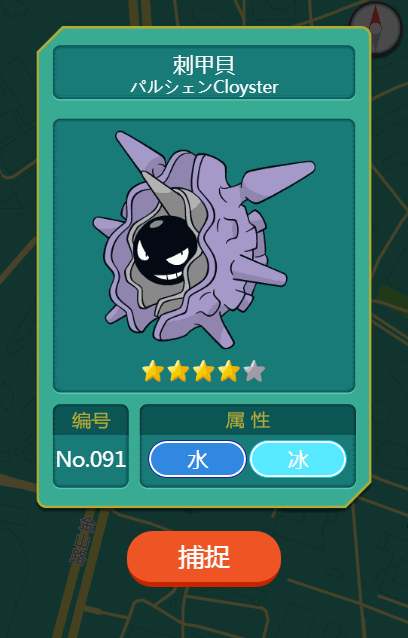

捕捉成功过程：


[查看DEMO][15]

### 十一、大木博士
在大木博士的实验室，小智得到了第一个精灵伙伴，那里是梦开始的地方。为了还原经典，我们加入一个简单的新手引导，通过与大木博士的对话，确定用户的性别，第一个伙伴，和简单的游戏玩法介绍。


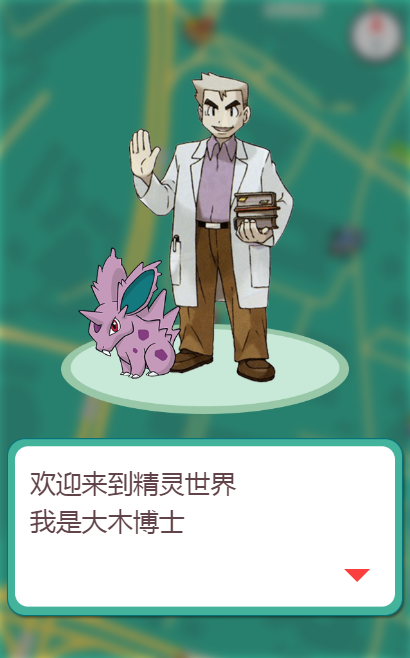

首先实现一个简单的打字效果：
```
typing(char,delay){
    var chars = char.split('');
    var index = 0,
        delay = 0;

    Element.$typeText.html('');
    Element.$typeNext.hide();   //打字过程隐藏下一步箭头
    State.typeOver = false;
    var timer = setInterval(function(){
        if(delay == delay){
            if(index == chars.length){
                clearInterval(timer);
                State.typeOver = true;
                Element.$typeNext.show();
                return;
            }
            if(chars[index] == '/'){
                Element.$typeText.append('<br>');  //判断换行位置
            }else{
                Element.$typeText.append(chars[index]);
            }
            index ++;
        }else{
            delay ++ ;
        }
    },50);
},
```
然后初始化新手引导：
```
initGuide : function(){
    var self = this;
    var sex = 1, pokenum = '001', typeIndex = 0;

    Method.typing('欢迎来到精灵世界/我是大木博士',10);

    Element.$modal.removeClass('show');  //隐藏所有弹窗
    Element.$modalGuide.addClass('show'); //显示新手引导弹窗
    Element.$body.addClass('blur');  //背景模糊

    Element.$typeBox.bind('tap',function(){
        //开始对话
        if(!State.typeOver) return;
        typeIndex ++;    
        switch (typeIndex) {
            case 1:
                Method.typing('这个世界到处都有精灵的存在/许多人把精灵当做伙伴',0);
                break;
            case 2:
                Method.typing('那么你是男孩还是女孩？/(选择角色)',0);
                Element.$modalGuide.addClass('setrole');  //进入选择角色界面
                Element.$setRole.bind('tap',function(){
                    $(this).addClass('selected').siblings().removeClass('selected');
                    sex = $(this).data('sex');
                });
                break;
            case 3:
                Method.typing('选择一只精灵作为你的伙伴吧/(选择精灵)',0);
                Element.$modalGuide.removeClass('setrole').addClass('setpoke');  //进入选择精灵界面
                Element.$setPoke.bind('tap',function(){
                    $(this).addClass('selected').siblings().removeClass('selected');
                    pokenum = $(this).data('number');
                    Element.$setFigure[0].className = 'img-' + pokenum;
                });
                Method.setItem('sex',sex);
                break;
            case 4:
                Method.typing('点击周围的小精灵即可抓捕!/(操作方式)',0);
                Element.$modalGuide.removeClass('setpoke');
                break;
            case 5:
                Method.typing('移动可能遇到随机出现的稀有精灵哦!/(随机事件)',0);
                break;
            case 6:
                Method.typing('请带上你的伙伴去冒险吧!',0);
                break;
            case 7:
                Element.$modalGuide.removeClass('show');
                Element.$body.removeClass('blur');
                self.ready();
                break;
            default:
        }
    });
},
```
[查看DEMO][16]

### 十二、完善更多
最后把界面上的一些数据展示的功能补上：

#### Loading


#### 精灵刷新倒计时


#### 系统公告
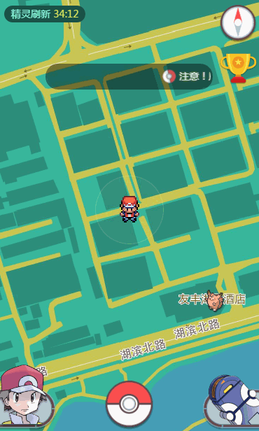

#### Toast提示
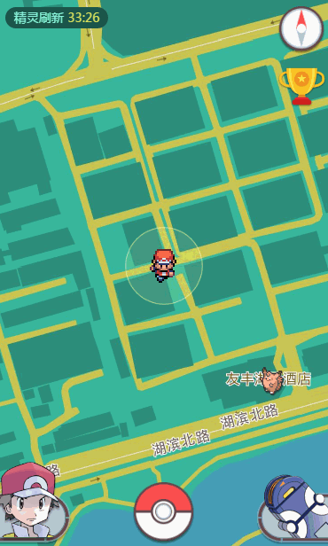

#### 训练师信息
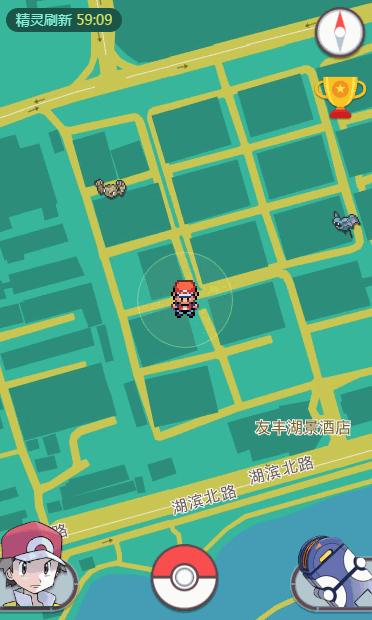

#### 精灵背包
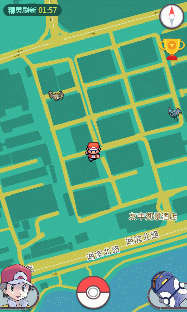

#### 精灵图鉴
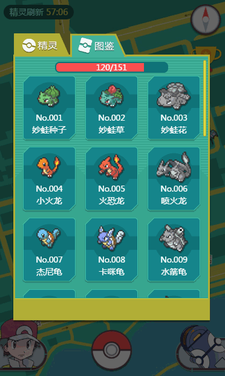

#### 精灵大师榜


最后附上完整版地址：

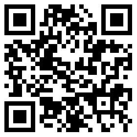


  [1]: https://www.guowc.cc/go/demo1.html
  [2]: http://lbs.amap.com/dev/mapstyle/index
  [3]: https://www.guowc.cc/go/demo2.html
  [4]: https://segmentfault.com/img/bVSeuN
  [5]: https://www.guowc.cc/go/demo3.html
  [6]: https://www.guowc.cc/go/demo4.html
  [7]: http://www.guowc.cc/api/sysUser/login?openid=o3aw6v1QLA6R7B0w6vPBfL9Ti8Mw
  [8]: https://www.guowc.cc/go/demo5.html
  [9]: https://segmentfault.com/img/bVSes1
  [10]: https://www.guowc.cc/go/demo6.html
  [11]: https://segmentfault.com/img/bVSexQ
  [12]: https://www.guowc.cc/go/demo7.html
  [13]: https://segmentfault.com/img/bVSnVe
  [14]: https://segmentfault.com/img/bVSnZM
  [15]: https://www.guowc.cc/go/demo8.html
  [16]: https://www.guowc.cc/go/demo9.html
  [17]: https://segmentfault.com/img/bVSqy8
  [18]: https://segmentfault.com/img/bVSqH6
  [19]: https://segmentfault.com/img/bVSqHO
  [20]: https://segmentfault.com/img/bVSq3C
  [21]: https://segmentfault.com/img/bVSqIN
  [22]: http://7x009g.com1.z0.glb.clouddn.com/17.gif
  [23]: http://7x009g.com1.z0.glb.clouddn.com/1.gif
  [24]: http://7x009g.com1.z0.glb.clouddn.com/2.gif
  [25]: http://7x009g.com1.z0.glb.clouddn.com/5.gif
